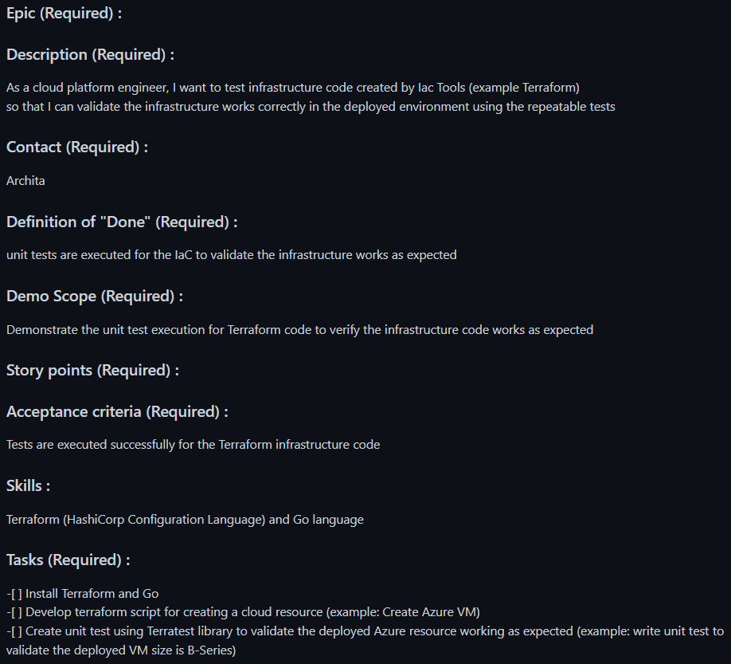

# Release 0

## Table of Contents

* [Introduction](#introduction)
  * [About me](#about-me)
  * [About Credera](#about-credera)
* [Knowledge, Skills and Behaviours](#knowledge-skills-and-behaviours)
* [Table of Tickets](#table-of-tickets)
* [Ticket 1](#ticket-1)
  * [Project Background](#project-background)
  * [Ticket Background](#ticket-background)
  * [Learning and Research](#learning-and-research)
  * [Completing the Ticket](#completing-the-ticket)
  * [Problems and Solutions](#problems-and-solutions)
  * [Conclusion](#conclusion)
* [Ticket 2](#ticket-2)
  * [Project Background](#project-background-1)
  * [Ticket Background](#ticket-background-1)
  * [Learning and Research](#learning-and-research-1)
  * [Completing the Ticket](#completing-the-ticket-1)
  * [Problems and Solutions](#problems-and-solutions-1)
  * [Conclusion](#conclusion-1)

## Introduction

### About Me

My Name is Hotu, and I'm from New Zealand, and before landing a position as an apprentice with Credera I was a chef for about 7 years. When I was still in highschool and the dream of becoming a snowboard instructor, when I finished highschool I moved to a ski town in the hopes of becoming one.
Better planing would have told me that I had made the trip too late in the season. Desperate for a job I applied everywhere.My hopes and dreams were dashed, and not wanting to pack up and leave I applied to everywhere I could, luckily a couple guys owned a seasonal pop-up pizza joint in the center of town offered me a job - *after a bit of pestering from myself*. In the 3 and a half years I was a pizza chef I studied culinary arts and helped them build their business by managing sites and opening new sites, etc.

Needing a new challenge I decided to move to Japan and break away from pizza. There I met my Sous Chef who had worked in Michelin starred restaurants. He inspired me to push myself even further and after a year-ish in Japan I decided to go to London and really test my mettle.
I got a job at a 1 star restaurant which was the hardest work, but also the most gratifying. About

### About Credera

Credera is a consulting firm focused on strategy, innovation, data, and technology. As a part of Omnicom Precision Marketing Group, Credera's approximately 3000 consultants across the globe partner with clients ranging from FTSE 100 companies and public sector giants to emerging industry leaders from strategy to execution to create tangible business results. Credera's deep business acumen and technical expertise, combined with a deep dedication to building trusted relationships, unlock extraordinary business performance for their clients. Its mission is to make an extraordinary impact on its clients, people, and communities.

## Knowledge, Skills and Behaviours

| KSB Number | KSB Description | Which ticket(s) | Overview of how I met it | Ticket Date | Document Link |
|:----------:|-----------------|:---------------:|--------------------------|-------------|---------------|
| K1 | Continuous Integration - the benefits of frequent merging of code, the creation of build artifacts and ensuring all tests pass, with automation throughout - including common tooling. | 1 | I know to use GitHub actions to implement a CI/CD pipeline and have it run tests to make sure that the code I am merging isn't introducing breaking changes, and to have this run on either a push to the required branch or when a pull request has been raised to merge the latest code into the main branch of the repository. | 10/01/2022 | |
| K7 | General purpose programming and infrastructure-as-code. |  1 & 2 | For both these tickets I relied heavily on Terraform for the infrastructure-as-code(IAC) and used Python for the AWS Lambda and Golang for testing the IAC. | 10/01/2022 | |
| K13 | Automation techniques, such as scripting and use of APIs. | 1 | I know how to use scripts to automate steps in a pipeline and when to implement automated testing and how to use software developer kits to make use of cloud provider API's | 10/01/2022 | |
| K14 | Test Driven Development and the Test Pyramid. How the practice is underpinned by unit testing, the importance of automation, appropriate use of test doubles and mocking strategies, reducing a reliance on end-to-end testing. | 2 | I understand the importance of TDD and how you can use this approach to build what is required, by following the TDD process you reduce, *generally*, the amount of code you're writing and making sure you stay in scope of the task at hand by trying to get the test to pass with the simplest implementation and building on top of that. | 14/02/2022 | |
| K17 | What an API is, how to find them and interpret the accompanying documentation. | 1 | An API is "application programme interface". It is a pre-existing block of code that allows to pieces of code to talk to each other, depending on your needs you can make your own API or make use of the million different API's out there. No point in reinventing the wheel. | 10/01/2022 | |
| K20 | Pair/mob programming techniques and when to use each technique. | 1 | I understand what pair and mobbing techniques are. At Credera I use them everyday to solve the problem at hand and understand when to employ these techniques. It's nice to be able to bounce ideas off of people, learn from others and teach at the same time. And you know what they say, *Two heads are better than one*. | 10/01/2022 | |
| S12 | Automate tasks where it introduces improvements to the efficiency of business processes and reduces waste, considering the effort and cost of automation. | 1 | I implemented a solution that would automatically tag AWS resources upon creation, saving time and money by pinpointing who created the resource and allowing you to calculate the cost for the resource that have been deployed. | 10/01/2022 | |
| S13 | Engage in productive pair/mob programming. | 1 | If at any point I hit a blocker, I would be able to pair with someone to bounce ideas off of.  | 10/01/2022 | |
| S14 | Write tests and follow Test Driven Development discipline in various different contexts. | 2 | Writing unit test for IAC isn't really something that people do | | |
| S17 | Code in a general purpose programming language. | 1 |  | 10/01/2022 | |
| S18 | Specify cloud infrastructure in an infrastructure-as-code domain-specific language. | 1 | I used Terraform to write up the IAC for AWS | 10/01/2022 | |
| B1 | Exhibits enthusiasm, openness and an aptitude for working as part of a collaborative community; e.g. sharing best practice, pairing with team members, learning from others and engaging in peer review practices. | 1 & 2 | The toughest part about these tickets was that it was mostly alone, about 80% solo work and 20% pairing. Nobody likes getting blocked, but when I did I really enjoyed having someone come in and share their knowledge with me. I really enjoyed raising PRs and having somebody tell me where I can make improvements and what I've done well, because, it gives me new goals work towards and how I can be a better DevOps engineer. | 10/01/2022 | |

## Table of Tickets

| Ticket number | Ticket |
|:-:|--------------------|
| 1 |  |
| 2 |  |

## Ticket 1

### Project Background

When joining Credera, depending on client engagements at the time, generally you'll be assigned to the bench to help create/improve internal products, this is only while you're not on a client. While on the bench, I didn't have the opportunity to do much as part of a team.
Every Monday and Wednesday there is a bench stand up where we discuss progress made or blockers on tickets we've been assigned to. You based on your interests, if nothing takes your fancy you will get assigned a ticket based on your experience.

### Ticket Background

This is part of an epic and was created as a ticket. I chose the ticket as it looked interesting and I hadn't done anything like this before. I would assume there were meetings before I was assigned to the ticket, as it was created before I joined. Because I had no idea what I was doing, I broke the ticket down into 2 steps in the beginning, manually test to see if the requirements are even possible, and then automate the process.

### Learning and Research

I had done a weeks worth of Terraform in the training before going onto placement, so I had to learn more about Terraform.

### Completing the Ticket

In the beginning I had no clue if this was possible, so I spent a lot of time googling. I found a video of someone who had implemented something similar through the UI. Seeing this I created a diagram of how I thought it was working - *this is the end result, in the beginning it only referenced the creation of S3 buckets*

With this in mind, I converted the diagram into Terraform, adding the missing parts that are auto-generated/easily overlooked as it could be a simple click of a button through the UI. My first step was to create a Lambda that would trigger on a specific event, *eg. a user creates an S3 bucket*, and have the Lambda log something simple. Once I had evidence that creation events were triggering the Lambda, I could then implement the logic that would provide the created resources with new tags.
Using the AWS SDK for python, *Boto3*, I could easily create an S3 client, scrape the logs for the bucket name, then provide the S3 client the bucket name, and then with an S3 client built-in function provide the bucket the required tags.
 

### Problems and Solutions

### Conclusion

## Ticket 2

### Project Background

### Ticket Background

### Learning and Research

### Completing the Ticket

### Problems and Solutions

### Conclusion
