# Apprenticeship Portfolio

<details>
<summary><h2>Click for Table of Contents</h2></summary>

## Table of Contents

- [Apprenticeship Portfolio](#apprenticeship-portfolio)
  - [Table of Contents](#table-of-contents)
  - [Version Control](#version-control)
  - [Introduction](#introduction)
    - [About Me](#about-me)
    - [About Credera](#about-credera)
    - [My Role](#my-role)
  - [Knowledge, Skills and Behaviours](#knowledge-skills-and-behaviours)
  - [Table of Tickets](#table-of-tickets)
  - [Onboarding](#onboarding)
  - [Ticket 1](#ticket-1)
    - [Project Background](#project-background)
    - [Ticket Background](#ticket-background)
    - [Learning and Research](#learning-and-research)
    - [Completing the Ticket](#completing-the-ticket)
      - [Trigger Evidence](#trigger-evidence)
      - [Lambda Handler](#lambda-handler)
      - [Tagging function](#tagging-function)
    - [Problems and Solutions](#problems-and-solutions)
      - [Pairing](#pairing)
    - [Conclusion](#conclusion)
  - [Ticket 2](#ticket-2)
    - [Ticket Background](#ticket-background-1)
    - [Learning and Research](#learning-and-research-1)
    - [Completing the Ticket](#completing-the-ticket-1)
    - [Problems and Solutions](#problems-and-solutions-1)
    - [Conclusion](#conclusion-1)

</details>

## Version Control

| Release | Date |
|---------| -----|
| [release_0](https://github.com/ClaimingCookie5/apprenticeship_portfolio/tree/release_0) | 09/09/2022 |
| [release_1](https://github.com/ClaimingCookie5/apprenticeship_portfolio/tree/release_1) | 21/10/2022 |

## Introduction

[:arrow_up: Table of Contents](#table-of-contents)

### About Me

My Name is Hotu, and I'm from New Zealand. Before landing a position as an apprentice with Credera I was a chef for about 7 years. While in highschool I had the dream of becoming a snowboard instructor. I finished highschool I moved to a ski town in the hopes of becoming one.Better planing would have told me that I had made the trip too late in the season.Desperate for a job I applied everywhere.My hopes and dreams were dashed, and not wanting to pack up and leave I applied to everywhere I could, luckily a couple guys owned a seasonal pop-up pizza joint in the center of town offered me a job - *after a bit of pestering from myself*. In the 3 and a half years I was a pizza chef I studied culinary arts and helped them build their business by managing sites and opening new sites, etc.

Needing a new challenge I decided to move to Japan and break away from pizza. There I met my Sous Chef who had worked in Michelin starred restaurants. He inspired me to push myself even further and after a year-ish in Japan I decided to go to London and really test my mettle.
I got a job at a 1 star restaurant which was the hardest work, but also the most gratifying. In 2020, as everyone is aware by now, the pandemic hit. The hospitality industry was devastated by the effects of the pandemic.

With a bunch of free time on my hands, I decided to learn how to do some basic coding through Free Code Camp, Codecademy, and Code wars. Restrictions were easing and I was called back into the kitchen where, I found that I no longer had the passion I once had for cooking. This prompted me to get serious about software development. I joined Makers Academy in July 2021, once finished I applied to a bunch of different jobs, one of which being this DevOps apprenticeship with Credera.

### About Credera

Credera is a consulting firm focused on strategy, innovation, data, and technology. As a part of Omnicom Precision Marketing Group, Credera's approximately 3000 consultants across the globe partner with clients ranging from FTSE 100 companies and public sector giants to emerging industry leaders from strategy to execution to create tangible business results. Credera's deep business acumen and technical expertise, combined with a deep dedication to building trusted relationships, unlock extraordinary business performance for their clients. Its mission is to make an extraordinary impact on its clients, people, and communities. Credera has 40 hour work week with 8 of those hours dedicated to personal development, which is heavily encouraged. You can use the 8 hours for taking exams, conferences,  and community projects.

### My Role

There are two positions that an DevOps engineer can fill at Credera, client work and bench work.

Client work is fulfilling the clients needs based on what the Credera consultants have assessed the clients needs are, while on client I work as part of a team in an agile manner. Standups are held everyday, where team members provide updates on progress, issues blocking them, and whether work that has been undertaken is priority or not. Work is assigned based on priority by the team lead. A demo is held every two weeks for stake holders to view the progress made.

Bench work is less formal, it is work between client work. Credera will find internal areas that need improving. Bench work can be as part of a small team, but generally solo work. Standups are held every Monday and Wednesday, demos are held once the ticket is complete. Work is assigned by interest, if there is something that you find interesting, you are free to pick up that work.

I have done bench work and at the moment I'm on client.

## Knowledge, Skills and Behaviours

[:arrow_up: Table of Contents](#table-of-contents)

| KSB Number | KSB Description | Which ticket(s) | Overview of how I met it | Ticket Date | Document Link |
|:----------:|-----------------|:---------------:|--------------------------|-------------|---------------|
| K3 | How to use data ethically and the implications for wider society, with respect to the use of data, automation and artificial intelligence within the context of relevant data protection policy and legislation. | N/A | Completed compliance training that involved learning about the GDPR | | [Onboarding](#onboarding) |
| K6 | A range of problem solving techniques appropriate to the task at hand, such as affinity mapping, impact maps, plan-do-check-act/Deming. | | | | |
| K9 | Different organisational cultures, the development frameworks utilised and how they can both complement each other and introduce constraints on delivery. | | | | |
| K18 | Roles within a multidisciplinary team and the interfaces with other areas of an organisation. | | | | |
| K19 | Different methods of communication and choosing the appropriate one - e.g. face-to-face (synchronous, high bandwidth), instant messaging, email (asynchronous, low bandwidth), visualisations vs. words. | 1 | I had to communicate with a wide range of people, mostly technical in nature. I used emails for more serious matters or to coordinate a time/date to demo my product, instant messaging/face-to-face ***(virtual)*** when asking for help, and lots of visuals when demoing. | 10/01/2022 | [Ticket 1](#ticket-image-1) |
| K20 | Pair/mob programming techniques and when to use each technique. | 1 | When I paired on this ticket I would "drive" and the senior would "navigate", only pairing once I had exhausted all my other options. | 10/01/2022 | Pairing feedback from an engineer, Mathew Ball 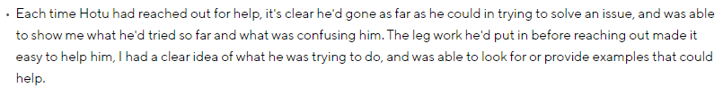 |
| K22 | How their occupation fits into the wider digital landscape and any current or future regulatory requirements. | | | | |
| K23 | The importance of continual improvement within a blameless culture. | | | | |
| K24 | The difference between Software-as-a-Service (SaaS) v bespoke v enterprise tooling and how to make an informed choice that suits each use case. | | | | |
| K25 | Maintain an awareness of cloud certification requirements. | | | | |
| S1 | Communicate credibly with technical and non-technical people at all levels, using a range of methods; e.g. ‘Show and Tell’ and ‘Demonstrations’. | 1 | Every Monday and Wednesday I would have a standup to talk through blockers/progress. I have demonstrated to multiple people how the product works, the use cases/benefits of it. | 10/01/2022 | [Ticket 1](#ticket-image-1) |
| S2 | Work within different organisational cultures with both internal and external parties. | | | | |
| S4 | Initiate and facilitate knowledge sharing and technical collaboration. | 1 | I have held multiple demos and written a blog on how/when to use the product, and also demonstrated/documented how to contribute to it. | 10/01/2022 | [Ticket 1](#ticket-image-1) |
| S8 | Work in agile, multi-disciplinary delivery teams, taking a flexible, collaborative and pragmatic approach to delivering tasks. | 2 | The ticket initially set out some requirements, upon delivering there was a realisation that the work produced didn't quite meet expectations. I had to adjust what I did and redeliver. | 10/02/2023 | [Ticket 2](#ticket-image-1) |
| S13 | Engage in productive pair/mob programming. | 1 | I would pair with a senior when I hit a blocker, explaining in detail what I had done and the problem I was running into, allowing them to "navigate" to the solution or showing me where to look for a potential solution. | 10/01/2022 | Pairing feedback from an engineer, Mathew Ball  |
| S16 | Invest in continuous learning, both your own development and others, ensuring learning activities dovetail with changing job requirements. Keep up with cutting edge. | | | | |
| S21 | Application of lightweight modelling techniques, such as whiteboarding, in order to gain consensus as a team on evolving architecture. | 1 | Used diagrams to show a high level overview of how projects work. | | [Autotagger Diagram](./images/Autotagger-Diagram.png) |
| B1 | Exhibits enthusiasm, openness and an aptitude for working as part of a collaborative community; e.g. sharing best practice, pairing with team members, learning from others and engaging in peer review practices. | | Behavioral feedback from my appraiser, Stephanie Quinn 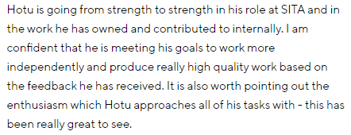 | | |
| B2 | Invests time and effort in their own development, recognising that technology evolves at a rapid rate. | | | | |
| B4 | Is inclusive, professional and maintains a blameless culture. | | | | |

[:arrow_up: Table of Contents](#table-of-contents)

## Table of Tickets

[:arrow_up: Table of Contents](#table-of-contents)

| Ticket number | Ticket |
|:-:|--------------------|
| <a id="ticket-image-1">1</a> | 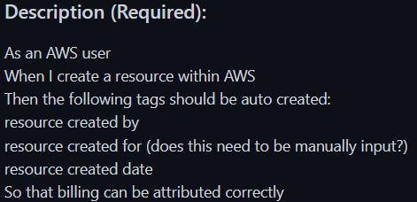 ||
| <a id="ticket-image-2">2</a> | 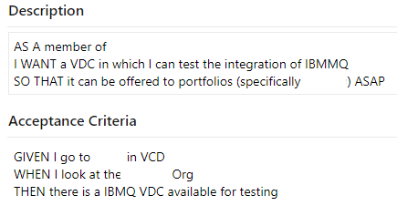 |

## Onboarding

[:arrow_up: Table of Contents](#table-of-contents)

As part of onboarding I am required to do internal training. This training happens once a year, and once for onboarding to bring new joiners up to speed. Part of the training covers what the GDPR and our responsibility to manage data ethically and give us an understanding of it's implications on the wider society. The training makes it clear on how to handle data, eg. personal data, giving clear definitive answers of what would be a breach of the GDPR and how to protect individuals from privacy and data breaches. Failing to comply with the regulation can have serious consequences which can result in fines of up to €20 million or 4% of global annual turnover, whichever is higher.

The GDPR impacts many areas of Credera, for me these areas are engineering and development/operations *(DevOps)*. It's important for me to be aware of the restrictions, and have a clear understanding of where my personal data is stored, transmitted, or accessed, to ensure compliance with the GDPR.
*(K3)*

In order to ensure the tool we are implementing deploys systems that are GDPR compliant, we build in security at all levels. I have worked on setting up pipeline steps to run ansible hardening scripts to ensure custom VM image templates have minimal attack surfaces. This ansible role contains scripts that eliminate or reduces known risks to the custom OS images templates we are creating.
I have used Trivy scan in an automated way to scan containers for known vulnerabilities allowing myself and the team to make informed decisions, determining whether the risk associated with the import is acceptable or not. These vulnerabilities are recorded and checked reviewed periodically to see if the risks are acceptable or not. I have also created functional tests and implemented them as part of the pipelines to ensure we are not introducing vulnerabilities into our logic and are properly handling errors to avoid data exposure, there is a powershell module that I use to talk to an endpoint, for whatever reason the password for the connection string is not setup to use SecureString. This means that if there's an error, sensitive data is output into the logs. To avoid this I setup some error handling so as not to expose the sensitive information.

All of this ensures that our deployed systems meet the integrity and confidentiality aspect of GDPR regulations and that the client is able to meet their accountability obligations.

## Ticket 1

[:arrow_up: Table of Contents](#table-of-contents)


### Project Background

When joining Credera, depending on client engagements at the time, generally you'll be assigned to the bench to help create/improve internal products, this is only while you're not on a client (external party). While on the bench, I didn't have the opportunity to do much as part of a team.
Every Monday and Wednesday there is a bench stand up where we discuss progress made or blockers on tickets we've been assigned to. You based on your interests, if nothing takes your fancy you will get assigned a ticket based on your experience.

### Ticket Background

[:arrow_up: Table of Contents](#table-of-contents)

This is part of an epic and was created as a ticket. I chose the ticket as it looked interesting and I hadn't done anything like this before. I would assume there were meetings before I was assigned the ticket, as the ticket was created before I joined Credera. I broke the ticket down into 2 steps in the beginning, manually test to see if the requirements are even possible, and then automate the process. The purpose of the ticket is to track resources deployed to AWS for cost and monitoring purposes.

### Learning and Research

[:arrow_up: Table of Contents](#table-of-contents)

I had done a weeks worth of Terraform training before going onto placement. I found a Youtube [video](https://www.youtube.com/watch?v=4zLTZh3bZd0&ab_channel=Tieho-The-Engineer) of someone explaining the process and how to do it manually. Lots of stack overflow.

### Completing the Ticket

[:arrow_up: Table of Contents](#table-of-contents)

Majority of this task was solo work, a couple of times I got stuck on something to do with Terraform or the way the AWS environment I was deploying to was configured.

In the beginning I had no clue if this was possible, so I spent a lot of time Googling, and a ton of trial and error. I used the Youtube video to see how it would be done manually and then converted it into Terraform. Seeing this I created a diagram of how I thought it was working - *this is the end result, in the beginning it only referenced the creation of S3 buckets*.

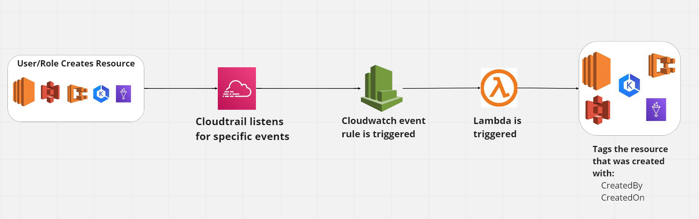
*diagram of the proccess for tagging resources in AWS*
*(S21)*

With this in mind, I converted the diagram into Terraform, adding the missing parts that are auto-generated/easily overlooked as it could be a simple click of a button through the UI. My first step was to create a Lambda that would trigger on a specific event, *eg. a user creates an S3 bucket*, and have the Lambda log `Hello, World!`.

#### Trigger Evidence

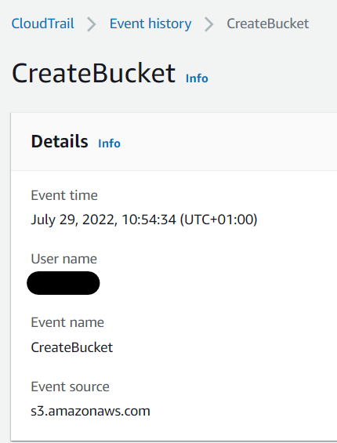

*screenshot of the creation event of a bucket*

Once I had evidence that the creation events were triggering the Lambda, I could then implement the logic that would provide the created resources with new tags.
Using the AWS SDK for python, *Boto3*, I could easily hit the AWS API and create an S3 client, scrape the logs for the bucket name, then provide the S3 client the bucket name, and then with an S3 client built-in function provide the bucket the required tags.

#### Lambda Handler

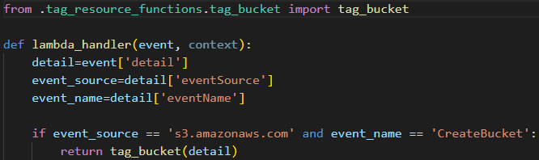

*screenshot of the Lambda's code*

#### Tagging function

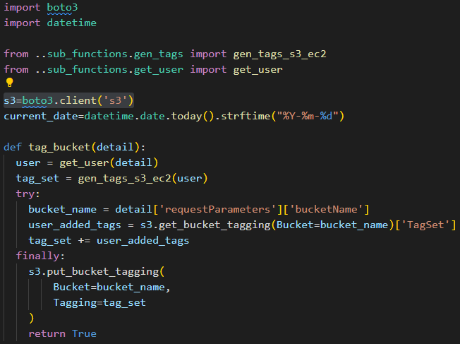

*screenshot of the code used to tag buckets*

Once deployed, create an S3 bucket and check your newly created bucket, you'll see that there are now tags attached to it:

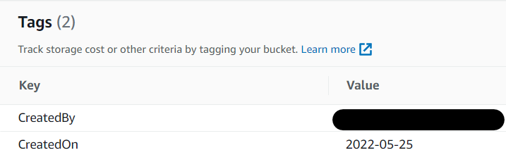

*evidence of a bucket having tags applied*

Once I could tag a bucket, targeting other resources was very easy, it was just a matter of changing the Boto3 resource I needed. To do this, only three Terraform resources are needed and the code for the lambda making it easy to contribute to and update.

I chose to use Python in this project for three reasons:

- I hadn't used it before, I wanted to challenge myself
- It had minimal setup versus Javascript when using the AWS SDK
- It's quick and easy to pick up
- It looks cleaner

I used Terraform as the IAC as that's what I had the most familiarity with.

### Problems and Solutions

[:arrow_up: Table of Contents](#table-of-contents)

One of the problems I faced when trying to tag S3 buckets, was that Boto3 didn't have a way to cleanly add tags to the bucket. On creation, S3 bucket would overwrite any tags it was already provided. I got around this by retrieving the tags that were attached to the bucket on creation and adding them to the list of tags that I wanted to provide.

Another issue I faced when expanding this project to incorporate more than just S3 buckets was, not all AWS resource take tags in the same way, which made this frustrating when I wanted to follow best practices and not repeat code, eg. S3 buckets, the accepted tags are formatted like so:

```python
'TagSet': [
  {'Key': 'CreatedBy', 'Value': user},
  {'Key': 'CreatedOn', 'Value': current_date}
]
```

but if I tried to do the same with an EKS cluster, all it would accept is the following:

```python
{
  'CreatedBy': user,
  'CreatedOn': current_date
}
```

#### Pairing

There are a few types of pairing styles:

- Ping-Pong Pairing:
The first person writes a failing test and the second person gets it to pass. Then the second person writes a failing test and the first person gets it to path. Back and forth, back and forth. Kind of like a game of ping pong. *I am yet to come across a scenario where I would implement this style of pairing.*
- Driver-Navigator:
The driver focuses on tactical concerns related to the mechanics of the activity like typing, navigating between files, and basic implementation. The navigator, on the other hand, looks at broader concerns and checks for mistakes. Does this method fit with the architecture? Are we potentially duplicating an implementation from elsewhere? Are we in a blind alley? *I am most familiar with this style of pairing and use it on a daily basis.*
- Backseat Navigator:
Like driver-navigator, the driver sits with their hands on the keyboard and executes the mechanics of typing and such. But unlike driver-navigator, their partner dictates tactical instructions. This might mean that they tell the driver when to create a method or open a new file. They might also tell the driver what to name a test or a variable. *I have used this method a few times when trying to debug a problem with a senior engineer, or when I'm helping a fellow apprentice overcome a problem they are facing.*
- Tour Guide:
The driver does the strategic and tactical thinking, along with the typing.  As they does this, they tell you (tourist), about what they're doing. The tourist rarely intervenes. *I use this style when onboarding someone onto the team and trying to get them up to speed on what we're doing, and vice versa, when I'm being onboarded to a new team.*
*(K20)*

In the beginning of this project there were two other tickets of the same nature for Azure and GCP, I paired with another apprentice to research on how we thought we could implement this for our respective cloud platforms or find some information where somebody has implemented this previously.

Other times when I would hit a blocker I would instant message, email, or call a more senior engineer to set up a time to do some pairing, when this was the case I would walk the them through the problem I was facing, giving a detailed explanation of what I had tried, where I thought it was going wrong. This allowed for quick debugging, and a valuable learning experience. For this situation I used the normal Driver-Navigator style of pairing, where I drove and the more experienced engineer navigated, checking to see where I had gone wrong and the implementation I'm applying is correct. I went with the Driver-Navigator approach as I have a more hands on role over the Tour Guide or Backseat navigator where I would have little to no input on what is being implemented. *(S13, K19)*
I really appreciated when the answer wasn't handed to me on a platter, so that I could take this new information and do some research into what could be the problem. I received this feedback on my pairing:


*(S13)*

### Conclusion

[:arrow_up: Table of Contents](#table-of-contents)

I was able to implement auto tagging for 5 different resources, S3 buckets, EC2 instances, ECK clusters, ECS clusters, and Glue registries. I made it easy to implement the logic for other resources by documenting thoroughly the approach one should take.
I learned some basic use of Python and deepened my knowledge on Terraform and AWS.This has helped by allowing Credera to pinpoint when and who created a resource, and track how much these resources are costing the company.

I demoed this project to some of the heads of Credera's AWS platform, these people have in-depth technical knowledge on the AWS platform. Because it was a technically competent audience I provided an architecture diagram on how it works and a live run through of what is happening in the background. I helped to prepare for Credera to apply for the AWS Security Competency - I developed the auto-tagger function that was used as evidence to support the case, I ran the presenter through the function and supported in the preparation of the demo that was given to AWS. As a result of this work, alongside similar work performed by my colleagues, we achieved the AWS Security Competency.
*(S1, S4)*

I wrote a step-by-step **[blog](https://medium.com/credera-engineering/auto-tagging-with-aws-and-terraform-246affbf6797)** on how to implement it, as I couldn't find anything in the beginning and thought people could benefit from it. This allowed me to share what I had learned and hopefully help somebody in the future and potentially widen Credera's reach.
*(S4)*

## Ticket 2

[:arrow_up: Table of Contents](#table-of-contents)


### Ticket Background

Some high priority work was assigned to the team I am in. It involved deploying a new development environment in VMware and setting up some basic infrastructure.

### Learning and Research

[:arrow_up: Table of Contents](#table-of-contents)

I used the VMware Terraform documentation to find out if what was being asked could be automated.

### Completing the Ticket

[:arrow_up: Table of Contents](#table-of-contents)

I created a repository which had some terraform and and a pipeline to provision the infrastructure that was required.

### Problems and Solutions

[:arrow_up: Table of Contents](#table-of-contents)

Initially the ticket requirements were that I was to build a new environment inside of an existing organisation. I requested a valid IP range to create network infrastructure. While in a discussion about how many IPs would be needed, it was discovered that I was creating a new environment and that that was not approved. I had to go back to the person who raised the request and work out what I could do to deliver what was needed.

Given the new set of requirements, there wasn't much work to do, I just had to rejig the existing repositories and tear down some infrastructure. I setup a demonstration for their Project manager and Developers to handover the work done so that their team could continue development. Quite early into the demonstration it was discovered that what I was handing over and what they were expecting were vastly different.
*(S8)*

### Conclusion

In the end the ticket was re-worked to fit some new requirements, and instead of developing the solution for them, we were given the task of helping the team to integrate their work with our orchestration pipeline and deploy their infrastructure as a service. I demoed how to use the pipeline to develop a service and have drawn up a diagram of the workflow the pipeline follows to their team and project manager, here's a picture of the diagram:
*(S1)*

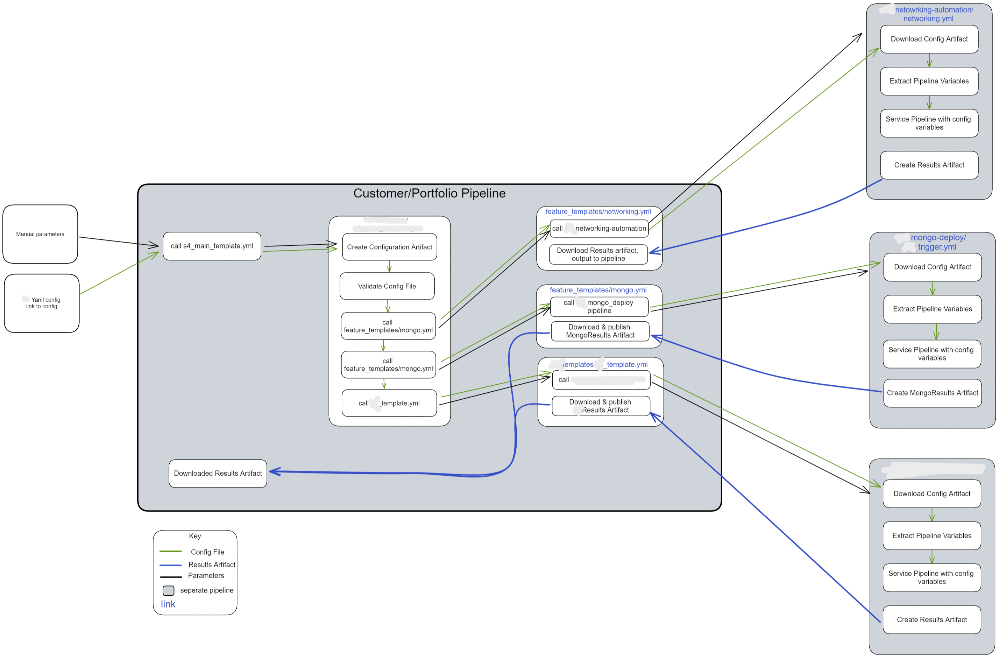
*I have removed some references to maintain privacy.*

As this is a continual process I sent an email and an invite to a meeting twice a week, and a teams chat to answer any question they may have around integrating with our orchestration pipeline. The team that is integrating with our work is spread across multiple time zones, so the meeting is recorded to adjust for those that may not be able to make it. The Teams chat is a less formal, adhoc, place to ask/answer any questions.
*(K19, S4)*

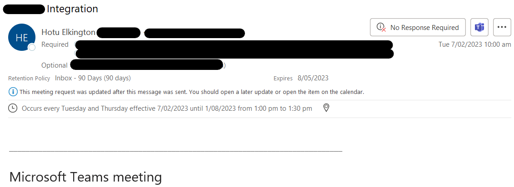
